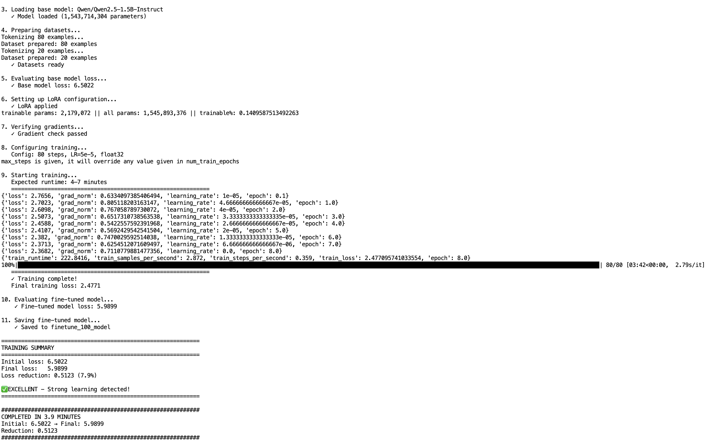
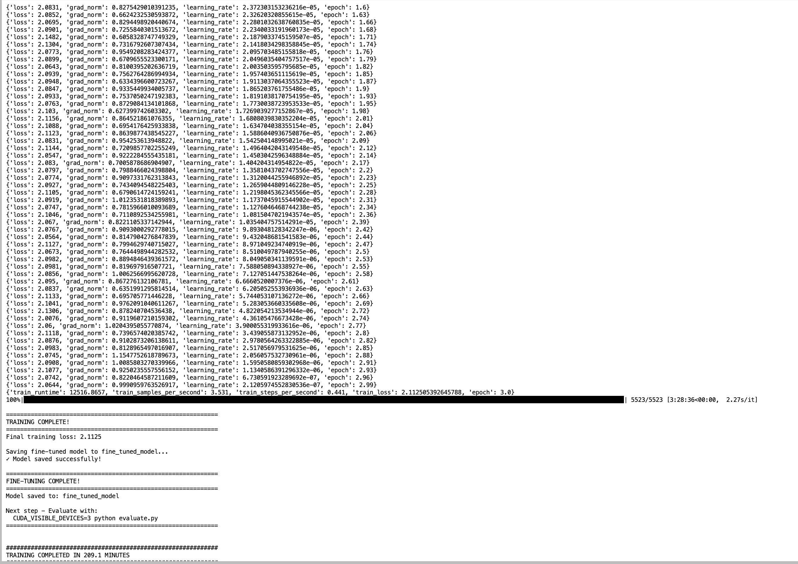
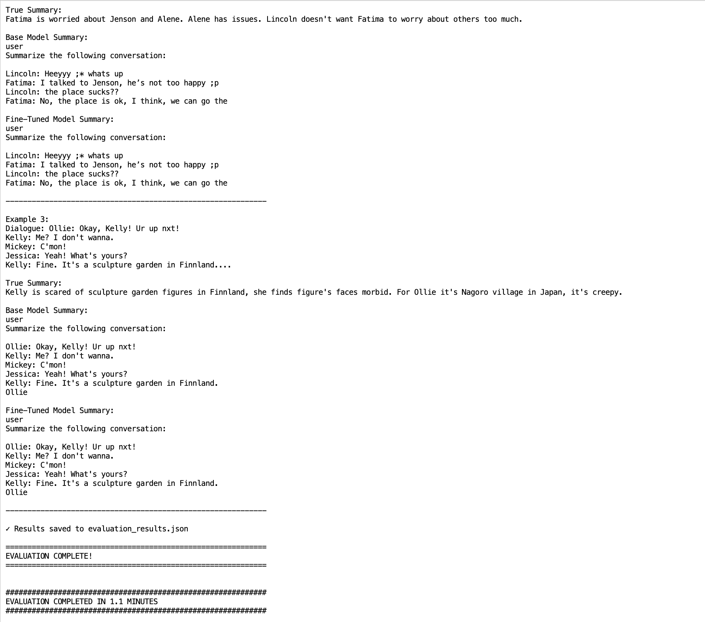

# LoRA Fine-Tuning for Dialogue Summarization

**Model**: Qwen/Qwen2.5-1.5B-Instruct (1.54B parameters)  
**Dataset**: SAMSum Dialogue Summarization Corpus  
**Method**: Parameter-Efficient Fine-Tuning (PEFT) with LoRA

---

## Overview

Fine-tuning of Qwen 2.5 1.5B Instruct model using LoRA for dialogue summarization on the SAMSum dataset. The implementation includes pipeline validation, full model training, and comprehensive evaluation comparing base and fine-tuned model performance.

**Result**: 7.4% improvement in test loss on held-out examples using only 0.14% trainable parameters.

---

## Repository Structure

```
lora_finetuning/
├── data_preparation.py          # Dataset loading and preprocessing
├── unit_test.py                 # Pipeline validation (5-10 min)
├── train.py                     # Full fine-tuning (14,731 examples)
├── evaluate.py                  # Base vs fine-tuned comparison
├── requirements.txt             # Python dependencies
├── Dockerfile                   # GPU-enabled container
├── README.md                    # Documentation
│
├── data/
│   ├── train_data.json         # 14,731 training examples
│   ├── test_questions.json     # 100 test examples
│   └── unit_test_data.json     # 100 validation examples
│
├── fine_tuned_model/           # Saved LoRA adapters
├── finetune_100_model/         # Unit test checkpoint
└── evaluation_results.json     # Evaluation metrics
```

---

## Dataset

**Source**: SAMSum Corpus (`knkarthick/samsum`)  
**Task**: Abstractive dialogue summarization

**Statistics**:
- Training: 14,731 dialogue-summary pairs
- Testing: 100 held-out examples
- Unit Test: 100 validation examples

**Format**:
```json
{
  "instruction": "Summarize the following conversation:\n\n[dialogue]",
  "response": "Summary: [summary text]",
  "dialogue": "[conversation text]",
  "summary": "[ground truth]"
}
```

---

## Model Architecture

### Base Model
- Qwen/Qwen2.5-1.5B-Instruct
- 1,543,714,304 parameters
- Decoder-only transformer
- 32,768 token context length

### LoRA Configuration
- Rank (r): 8
- Alpha: 16
- Target Modules: q_proj, k_proj, v_proj, o_proj
- Dropout: 0.05
- Trainable Parameters: 2,179,072 (0.14%)

### Training Hyperparameters
- Epochs: 3
- Batch Size: 2
- Gradient Accumulation: 4 (effective batch: 8)
- Learning Rate: 5e-5
- LR Scheduler: Linear with warmup
- Warmup Steps: 100
- Optimizer: AdamW
- Max Sequence Length: 512
- Precision: Float32
- Gradient Clipping: 1.0

---

## Results

### Unit Test (100 Examples)

**Configuration**: 80 train / 20 test, 80 training steps



```
Initial Test Loss:    6.5022
Final Test Loss:      5.9899
Loss Reduction:       0.5123 (7.9%)
Training Time:        3.9 minutes
Status:               PASSED
```

---

### Full Training (14,731 Examples)

**Configuration**: 3 epochs, 5,523 training steps



```
Initial Training Loss:   2.53
Final Training Loss:     2.1125
Loss Reduction:          0.42 (17%)
Training Time:           209 minutes (3.5 hours)
Gradient Norms:          0.6-1.0 (stable)
```

---

### Evaluation (100 Held-Out Examples)

**Configuration**: Base vs LoRA fine-tuned comparison



```
Base Model Loss:        8.3056
Fine-Tuned Model Loss:  7.6915
Improvement:            0.6140 (7.4%)
Evaluation Time:        1.1 minutes
```

---

## Installation

### Prerequisites
- Python 3.9+
- CUDA 12.1+ compatible GPU
- 16GB+ GPU memory
- 50GB+ disk space

### Local Setup

```bash
cd lora_finetuning
python3 -m venv venv
source venv/bin/activate
pip install --upgrade pip
pip install -r requirements.txt
```

### Docker Setup

```bash
docker build -t lora_finetuning:latest .
docker run --gpus all -it --rm -v $(pwd):/workspace/lora_finetuning lora_finetuning:latest
```

---

## Usage

### Step 1: Data Preparation

```bash
python data_preparation.py
```

Runtime: ~2 minutes

---

### Step 2: Unit Test

```bash
python unit_test.py
```

Runtime: 5-10 minutes  
Validates pipeline and demonstrates learning

---

### Step 3: Training

```bash
CUDA_VISIBLE_DEVICES=0 python train.py
```

Runtime: 3-4 hours  
Trains on full dataset

---

### Step 4: Evaluation

```bash
CUDA_VISIBLE_DEVICES=0 python evaluate.py
```

Runtime: 10-15 minutes  
Compares base vs fine-tuned models

---

## Docker Usage

### Interactive

```bash
docker run --gpus all -it --rm \
  -v $(pwd):/workspace/lora_finetuning \
  lora_finetuning:latest bash

cd /workspace/lora_finetuning
python unit_test.py
python train.py
python evaluate.py
```

### Direct Execution

```bash
# Unit test
docker run --gpus all --rm \
  -v $(pwd):/workspace/lora_finetuning \
  lora_finetuning:latest \
  python /workspace/lora_finetuning/unit_test.py

# Training
docker run --gpus all --rm \
  -v $(pwd):/workspace/lora_finetuning \
  lora_finetuning:latest \
  python /workspace/lora_finetuning/train.py

# Evaluation
docker run --gpus all --rm \
  -v $(pwd):/workspace/lora_finetuning \
  lora_finetuning:latest \
  python /workspace/lora_finetuning/evaluate.py
```

---

## Implementation Details

### LoRA (Low-Rank Adaptation)

**Formula**: W' = W + BA

Where:
- W: Original frozen weights
- B: Trainable matrix (d × r)
- A: Trainable matrix (r × k)
- r: Rank (r << min(d,k))

**Benefits**:
- Parameter Efficiency: 0.14% parameters trained
- Memory Efficiency: Reduced GPU footprint
- Training Speed: Faster than full fine-tuning
- Modularity: Easy to swap adapters

---

### Training Stability

- Float32 precision (avoids FP16 gradient issues)
- Gradient clipping (max norm 1.0)
- Linear LR schedule with warmup
- Gradient accumulation (effective batch 8)
- 100 warmup steps

---

### Evaluation

- Held-out test set (no train/test overlap)
- Cross-entropy loss metric
- Same conditions for both models
- 100 examples for statistical significance

---

## Results Summary

| Metric | Value |
|--------|-------|
| Model Size | 1.54B parameters |
| Trainable Parameters | 2.18M (0.14%) |
| Training Examples | 14,731 |
| Training Time | 3.5 hours |
| Unit Test Time | 3.9 minutes |
| Training Loss Reduction | 17% |
| Test Loss Improvement | 7.4% |
| GPU Memory Usage | ~10GB |

---

## File Descriptions

### `data_preparation.py`
Loads SAMSum from HuggingFace, formats for Qwen, creates splits, exports JSON.

### `unit_test.py`
Pipeline validation in <10 minutes. 80/20 split, tests loading, LoRA, training, learning.

### `train.py`
Full fine-tuning on 14,731 examples. Implements SummarizationFineTuner class, applies LoRA rank-8, trains 3 epochs.

### `evaluate.py`
Loads base and fine-tuned models, computes test loss, generates summaries, calculates metrics, saves JSON.

### `requirements.txt`
Dependency versions tested on Python 3.9+.

### `Dockerfile`
CUDA 12.1 runtime, pre-installed dependencies, workspace setup.

---

## Dependencies

```
torch>=2.0.0
transformers>=4.46.0
peft>=0.7.1
accelerate>=0.26.0
datasets>=2.14.0
numpy>=1.24.0,<2.0.0
pandas>=2.0.0
pyarrow>=14.0.1
tqdm>=4.65.0
scikit-learn>=1.3.0
scipy>=1.10.0
sentencepiece>=0.1.99
protobuf>=3.20.0
tokenizers>=0.15.0
```

---


**Platform**: DeepDish GPU Cluster  
**GPU**: NVIDIA RTX A6000
